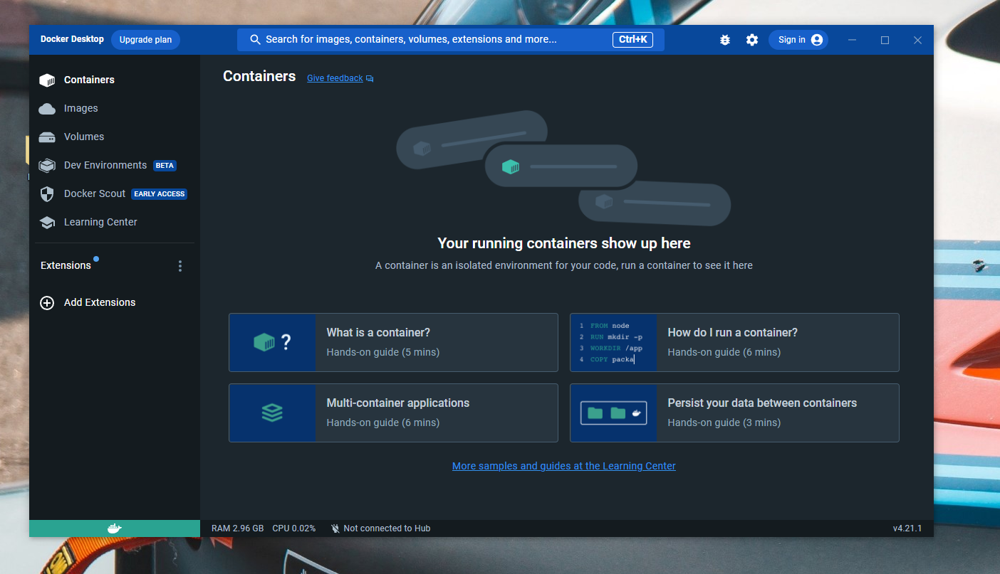

Tool Installation Guide for "Marcel"
====================================

# Overview

This guide decribe to tool installtion process on Windows for the following tools:
- Docker
- Visual Studio Code
- Git
- Python

# Docker
Please download the installer for "Docker Desktop for Windows".
After the installation, a restart will likely be necessary, or the "WSL" needs to be added.

Link to the installer: https://docs.docker.com/desktop/install/windows-install/

## Adding WSL
"WSL" or the "Windows Subsystem for Linux" is an addition to Windows to allow our project to run 
(which is based on Linux).

Press the Windows key + R and enter `cmd`, then hit enter. A command line window will then open...

In the window, please enter the following command: `wsl --update` and confirm with Enter.

## Restart Docker
Start Docker.

After the "WSL" has been installed and Docker is started for the first time afterwards, it may take quite a long time for the waiting message to disappear (5-10 minutes)...

The Docker application window can be closed with the X (Close button). Docker will still continue to run in the background (recognizable by the whale icon in the system tray).

## Testing the Docker installation
Open a command line window (Windows key + R, then enter `cmd` and hit enter).
In the command line window, enter the following command: `docker run hello-world` and confirm with Enter.

It is expected that you will find a message "Unable to find image... locally". 
Though it is important to also see "Hello from Docker".

# Visual Studio Code
Please download the installer "x64" for "Visual Studio Code".
https://code.visualstudio.com/download/

After the installation and running Visual Studio Code (VSC) install the the recommended extensions for WSL and Docker. 

# Git

## Installation
Please download the installer for "Git for Windows".
https://github.com/git-for-windows/git/releases/download/v2.41.0.windows.3/Git-2.41.0.3-64-bit.exe

Answer all options with the preselected responses and 'click through'.

## Testing the Git installation

Open a command line window again with Windows key + R and `cmd`. Then enter the command `git --version`. The following should appear:

# Python

## Installation
To install Python, please download the x64 installer https://www.python.org/ftp/python/3.11.4/python-3.11.4-amd64.exe

Most settings can stay at the default options. BUT "Add Python to environment variables" should be selected under "Advanced Options" (appears towards the end of the process).

## Testing the Python installation

Open a command line window again with Windows key + R and `cmd`. Then enter the command `python --version`. 
Also enter just `python` and then `print("Hello Marcel")`, an output should follow. You can exit with `quit()`.

